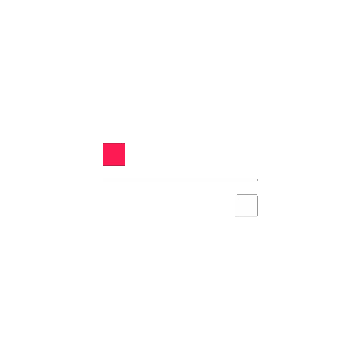

### Hi there, I'm <a href="https://github.com/kunalkundrra">Kunal Kundra!</a> 👋

 
 
</img> 

  

<ul>
  <li> 🔭 I’m currently working on JavaScript Projects. </li>
  <li>🌱 I’m currently learning React, Vue and Ruby on Rails. </li>
  <li> 👯 I’m looking to collaborate to <strong> Open Source </strong>. </li>
 <li> 🎃 Pronouns: He/Him </li>
  <li> 📫 Feel free to poke me: <a href="mailto:kunalkundrra@gmail.com">Send email</a> </li>
 <li> ♥ Fun fact: I know it's crazy, but I love to eat…</li>
</ul>

 

 
</img>

### Languages:

     

### Frameworks:

                

### Tools:

       
